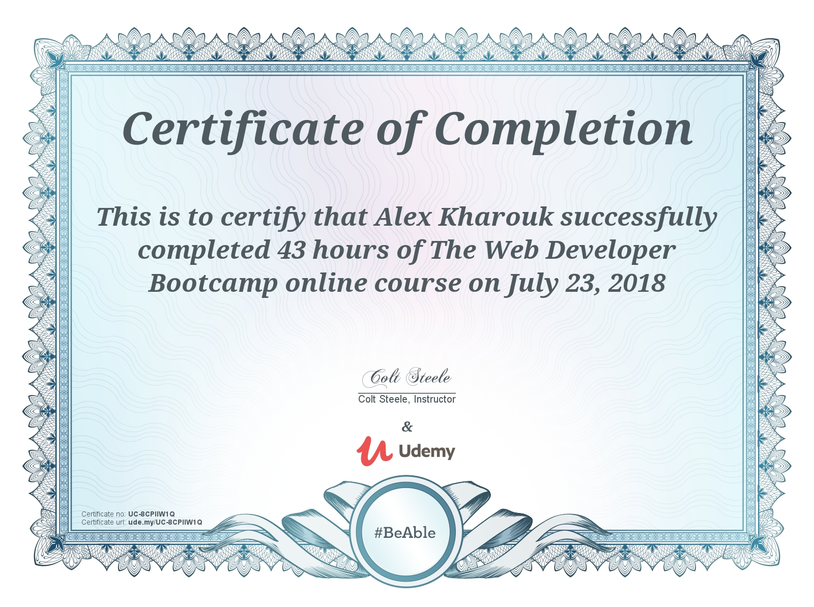

- Makers Academy - Four Months
  - Final Project - A navigational application that focuses on those with accessibility concerns. [MADE to Help](https://github.com/kharouk/made-to-help).
- The Web Developer Bootcamp - 40 Hours
  - Award For Completion:
  
  - [Deployed Application](https://immense-waters-78222.herokuapp.com/)
- React for Beginners - 5 hours
  - An introduction to React taught by Wes Bos. Focused on creating an application which allows users to set up a fishing shop.
  - [Deployed Application](https://catchmeifyoucan.now.sh/)
  - Award for completion:
  
